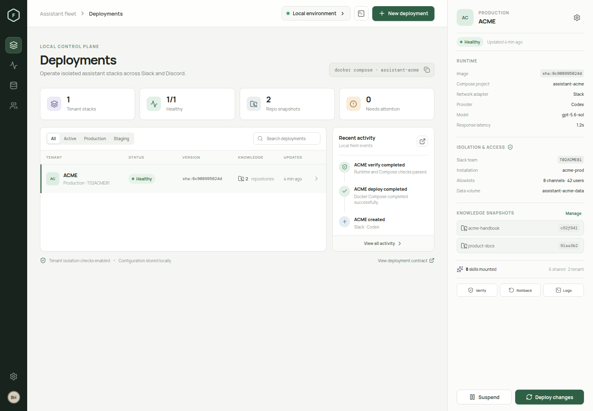

# Assistant Fleet

A local TypeScript control plane for isolated deployments of
[`Rubiss-Projects/ai-assistant`](https://github.com/Rubiss-Projects/ai-assistant)

The React client and Node API create typed Slack or Discord tenant definitions,
render one hardened Compose project per tenant, and operate those projects through
the local Docker daemon. Copilot, Codex, and OpenCode remain independent provider
choices for either network adapter.



## Start with Docker Compose

Docker Engine with Compose v2 is required.

```bash
cp .env.console.example .env.console
# Add the environment-backed secret references your tenants will use.
docker compose up -d --build
```

Open <http://127.0.0.1:8080>. Override the host port when necessary:

```bash
FLEET_PORT=8090 docker compose up -d --build
```

The control-plane container mounts the Docker socket because it creates and
operates sibling tenant projects. It is deliberately published on localhost only.
Do not expose it directly to a network; put an authenticated reverse proxy in
front of it if remote administration is required. Tenant assistant and browser
containers never receive the Docker socket.

## Adapter setup guides

- [Create and configure a Slack app](docs/slack-app-setup.md)
- [Create and configure a Discord app](docs/discord-app-setup.md)

## Local development

Requires Node.js 22.14+ and Docker Compose.

```bash
npm install
npm run dev
```

The client runs on `http://127.0.0.1:5173` and proxies `/api` to the typed API on
port `8787`.

Quality checks:

```bash
npm run typecheck
npm run build
docker compose config --quiet
```

The planned writable-repository contribution workflow and its API, frontend,
broker, and E2E task breakdown are documented in
[Contribution repositories delivery plan](docs/contribution-repositories-plan.md).
The contract tests can be listed with `npx playwright test --list`; they become
green as the planned endpoints and UI are delivered. The live remote branch-push
test is separately gated and never runs as part of the default suite.

## What is operational

- Typed Slack and Discord creation flows with adapter-specific requirements
- Independent Copilot, Codex, and OpenCode provider configuration
- Runtime validation at the API boundary; `:latest` images are rejected
- Atomic state persistence in `data/state.json`
- Tenant files and revision history under `tenants/<slug>/`
- Generated assistant/browser Compose projects with dedicated named data volumes
- External secret-reference resolution without writing secret values to disk
- In-place migration support for existing data volumes, managed workspaces, auxiliary secret references, and tenant-local n8n intake relays
- Deploy, suspend, resume, verify, rollback, and container-log operations
- Immutable read-only knowledge snapshot mounts
- Persisted GitHub/Bitbucket contribution-repository registry with many-to-many tenant assignments
- Tenant-scoped `fleet-contribute` workflow for isolated checkouts, validated commits, protected `assistant/*` branch pushes, and pull-request handoff URLs
- Reviewed skillsets copied into each tenant's writable provider directory by a one-shot initializer
- Activity history, configuration editing, JSON export, and 15-second refresh

## Secret references

Secret values are never accepted by the tenant form. A tenant stores one of these
references instead:

- `secret://slack/acme/app-token` resolves from
  `FLEET_SECRET_SLACK_ACME_APP_TOKEN` in `.env.console`.
- `env://MY_EXISTING_VARIABLE` resolves directly from that process variable.
- `file:///run/secrets/acme-token` reads a file mounted through `secrets/`.

Slack `xapp-...` and `xoxb-...` values belong in `.env.console` (or another
supported secret source); tenant records store references to those secrets.

Only the resolved child `docker compose` process receives secret values. Generated
YAML and `deployment.json` retain placeholders/references. `.env.console`, runtime
state, rendered tenants, secret files, and promoted snapshots are ignored by Git.

## Provider authentication

Provider state and credentials are isolated in each tenant's named data volume.
Choosing **Persisted CLI login** does not share an existing login with a new
tenant. After its first deployment, authenticate inside that tenant's assistant
container. For a Codex tenant named `acme`:

```bash
docker exec -it assistant-acme-assistant-1 codex login --device-auth
docker exec assistant-acme-assistant-1 codex login status
```

Complete the device flow printed by the first command. The resulting Codex login
is stored only in `assistant-acme-data`; another tenant needs its own login. Normal
redeploys and container recreation preserve it because they retain the named
volume. Removing the tenant volume removes the persisted login.

Alternatively, choose **Secret reference** in the tenant form and provide a
tenant-specific reference for `OPENAI_API_KEY`. The control plane resolves that
reference only when it launches the tenant Compose project.

## Fleet directories

```text
data/                         API state
tenants/<slug>/               deployment.json, prompt, Compose, revisions
rendered-skillsets/<slug>/    reviewed tenant skill bundle
repository-snapshots/         <repo>/releases/<exact-revision>/
secrets/                      optional local secret files
```

To mount knowledge, publish the exact snapshot directory first, then add the
repository and revision in the console. The API rejects missing or path-unsafe
snapshot references.

## API

The same-origin API exposes:

- `GET /api/health`, `GET /api/state`
- `POST /api/deployments`, `PUT /api/deployments/:id`
- `GET /api/deployments/:id/compose`, `GET /api/deployments/:id/logs`
- `POST /api/deployments/:id/repositories`
- `GET /api/deployments/:id/contributions[/:contributionId]`
- `POST /api/deployments/:id/contributions/prepare`
- `POST /api/deployments/:id/contributions/:contributionId/{publish|abort}`
- `POST /api/deployments/:id/actions/{deploy|suspend|resume|verify|rollback}`

Set `FLEET_DOCKER_ENABLED=false` to exercise configuration and rendering without
allowing runtime Docker operations.
